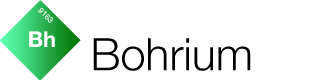

# Bohrium



Bohrium is part of the **[E-sites iOS Suite](https://github.com/e-sites/iOS-Suite)**.

---

A small helper class to benchmark specific code parts at runtime.

[](http://forthebadge.com) [](http://forthebadge.com)

[](http://cocoadocs.org/docsets/Bohrium)
[](http://cocoadocs.org/docsets/Bohrium)
[](https://cocoapods.org/pods/Bohrium/quality)
[](https://travis-ci.org/e-sites/Bohrium)


# Installation

Podfile:

```ruby
pod 'Bohrium'
```

And then

```
pod install
```

# Implementation

```swift
import Bohrium

let timer = Bohrium.Timer(name: "APIRequest")

Alamofire.request("https://httpbin.org/get").responseJSON { response in
   timer.tick("Response received")
   
   YourSpecialParser.parse(response) { result in
   	   timer.stop("Parser finished")
   }
}
```

Would result into something like this:

```
[Bohrium] 🔫 Start 'APIRequest' 
[Bohrium] ⏱ 'APIRequest' at 1.036: "Response received" (+ 1.036)
[Bohrium] 🏁 'APIRequest' at 2.346: "Parser finished" (+ 1.309)
```